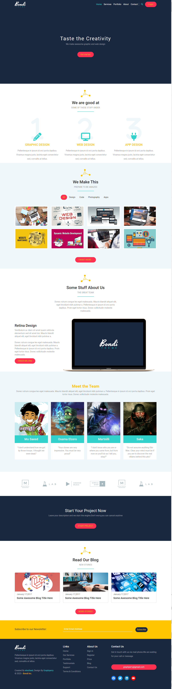

<h2>About the project</h2>

  
A <b>Bondi</b> is a responsive website template built with HTML, Bootstrap. This website will be a personal portfolio website that showcases my skills and experience as a web developer. The website will be built using HTML, CSS, and Bootstrap.

<h5>Some of the key features of Leon include:</h5>
<ul>
  <li>The website will be responsive, meaning it will look good on all devices, including desktops, laptops, tablets, and smartphones.</li>
  <li>The website will use Bootstrap, a popular front-end framework that makes it easy to create responsive websites.</li>
  <li>Clean and uncluttered code</li>
  <li>Easy to customize</li>
  <li>Well-documented code</li>
</ul>

👉 Live Demo: <a href='https://bondi-elsa33eed.vercel.app/' target="_blank">Live Demo</a>

<h3>Build with:</h3>

» HTML  
» CSS  
» Bootstrap

<h2>Screenshots of the Project 📸</h2>
 
<h3 align='center'>Home Page 🏡</h3>

